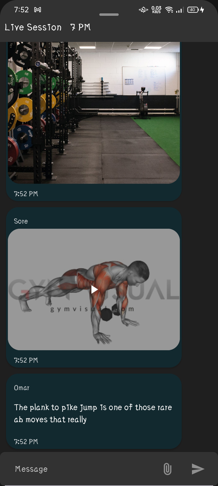
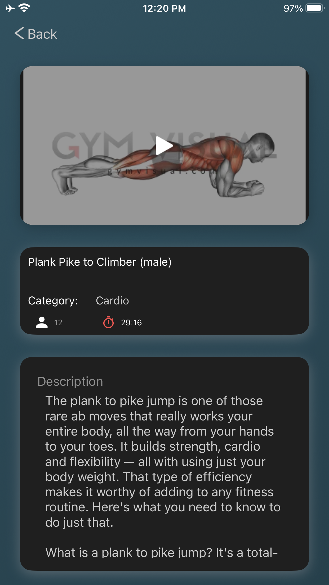

# WorkOutly: Gym & Fitness & Workout Demo App

WorkOutly is a fitness and workout management application Powered by **IOS HealthKit** and Integrated with **Android Health Connect** that leverages AWS services for backend infrastructure. This document guides you through configuring AWS components like DynamoDB, Lambda, Cognito, API Gateway, S3 and CloudFront for both REST API and WebSocket functionalities.

## 🤩 Support Me

<a href="https://www.buymeacoffee.com/omar_kader">
    
</a>

## Core Features

- **Kotlin Multiplatform Health Integration**: 
  - iOS: Powered by **HealthKit**.
  - Android: Integrated with **Health Connect**.
- **Workout Tracking**: Log and track your workouts in real time.
- **Steps and Activity Monitoring**: Monitor daily step counts and activity trends.
- **Health Analytics**: Visualize key health metrics such as calories burned, heart rate, and more.
- **Customizable Goals**: Set personal fitness goals and track progress.
- **User-Friendly Interface**: A clean and simple design focused on usability.
- **AWS-Backed Architecture**: 
  - **DynamoDB**: For storing user video exercises and live session chat.
  - **AWS Lambda**: For serverless computation and real-time data processing.
  - **API Gateway REST API and WebSocket**: To provide secure and scalable communication between the app and backend.
  - **CloudFront and S3**: For fast and reliable content delivery and static asset hosting. 

## Prerequisites

- An AWS account.
- AWS CLI installed and configured.
- Basic knowledge of AWS services.

## Configuration Guide

### 1. **DynamoDB**

#### Steps:
1. **Create a DynamoDB Table**:
   - Go to the DynamoDB service in the AWS Management Console.
   - Click `Create table` and provide the following details:
     - Table name: `WorkOutlyTable`
     - Primary key: `id (String)`
   - Enable on-demand or provisioned capacity as per your application's needs.
2. **Add Additional Attributes**:
   - Add attributes like `userId`, `workoutDetails`, `timestamp`, etc., based on your application's data model.

#### Notes:
- Use AWS SDK (e.g., boto3 for Python, AWS SDK for JavaScript) to interact with the table programmatically.

### 2. **Lambda**

#### Steps:
1. **Create a Lambda Function**:
   - Go to the Lambda service and click `Create function`.
   - Select `Author from scratch` and provide:
     - Function name: `WorkOutlyFunction`
     - Runtime: Choose your preferred runtime (e.g., Node.js, Python, Java).
2. **Add Permissions**:
   - Attach a role with the following policies:
     - `AmazonDynamoDBFullAccess`
     - `CloudWatchLogsFullAccess`
3. **Deploy Code**:
   - Upload your code zip or use an inline editor.
   - Ensure the code has necessary SDK calls to DynamoDB and any other required services.

### 3. **API Gateway**

#### For REST API:
1. **Create a REST API**:
   - Go to API Gateway and click `Create API` > `REST API`.
   - Choose `New API` and provide an API name.
2. **Define Resources and Methods**:
   - Add resources (e.g., `/workouts`, `/users`).
   - Add HTTP methods (e.g., GET, POST, PUT, DELETE) to each resource.
3. **Integrate with Lambda**:
   - Choose `Lambda Function` as the integration type.
   - Link the created Lambda function.
4. **Deploy API**:
   - Create a deployment stage (e.g., `dev`, `prod`).

#### For WebSocket API:
1. **Create a WebSocket API**:
   - Choose `WebSocket API` and provide:
     - WebSocket name.
     - Routes like `$connect`, `$disconnect`, `broadcast`.
2. **Integrate with Lambda**:
   - Attach Lambda functions to the WebSocket routes.
3. **Deploy WebSocket API**:
   - Deploy the API and note the WebSocket URL.

### 4. **S3 with CloudFront**

#### Steps:
1. **Create an S3 Bucket**:
   - Go to S3 and click `Create bucket`.
   - Provide a bucket name (e.g., `workoutly-static-assets`).
   - Enable public access if necessary for static content.
2. **Upload Files**:
   - Upload your static web files (e.g., HTML, CSS, JavaScript).
3. **Configure Bucket Policy**:
   - Add a policy to allow public read access for static assets (optional).
4. **Create a CloudFront Distribution**:
   - Go to CloudFront and click `Create Distribution`.
   - Choose `Web` as the delivery method.
   - Set the origin domain name to your S3 bucket.
   - Configure caching and SSL/TLS settings.
5. **Link Domain (Optional)**:
   - Use Route 53 or another DNS provider to map a custom domain to the CloudFront distribution.

#### Notes:
- Use versioning in S3 for better content management.
- Leverage invalidation in CloudFront to update cached content.

### 5. **Health Data Integration**

#### iOS (Swift HealthKit):
1. **Enable HealthKit in Your Project**:
   - Go to your Xcode project settings.
   - Under `Signing & Capabilities`, click `+ Capability` and add `HealthKit`.
2. **Request Permissions**:
   - Use `HKHealthStore` to request permissions to read/write health data.
3. **Access Health Data**:
   - Use `HKSampleQuery` or other HealthKit queries to retrieve data like steps, heart rate, or workouts.

#### Android (Health Connect):
1. **Add Health Connect Dependency**:
   - Include the Health Connect API in your `build.gradle`:
     ```
     implementation "androidx.health.connect:health-connect-client:<latest_version>"
     ```
2. **Request Permissions**:
   - Use `HealthPermissions` to request user consent for accessing health data.
3. **Access Health Data**:
   - Use `HealthConnectClient` to read or write health and fitness data.

## 🔗 Links & Dependencies

[](https://kotlinlang.org/docs/multiplatform.html)

[](https://developer.android.com/studio?gclsrc=aw.ds)

[](https://developer.apple.com/documentation/xcode)

[](https://developer.apple.com/tutorials/app-dev-training)

[](https://developer.apple.com/xcode/swiftui/)

[](https://www.jetbrains.com/help/kotlin-multiplatform-dev/compose-multiplatform-getting-started.html#join-the-community)

[](https://github.com/InsertKoinIO/koin)

[](https://ktor.io/)

[](https://github.com/Swinject/Swinject)

<!--suppress CheckImageSize -->
Screenshot
-------------

### Android

#### Client
<table>
    <tr>
      <td>  </td>
      <td>  </td>
    </tr>
    <tr>
      <td>  </td>
      <td>  </td>
    </tr>
    <tr>
      <td>  </td>
      <td>  </td>
    </tr>
    <tr>
      <td>  </td>
    </tr>
</table>

-----

### IOS

#### Client
<table>
    <tr>
      <td>  </td>
      <td>  </td>
    </tr>
    <tr>
      <td>  </td>
      <td>  </td>
    </tr>
    <tr>
      <td>  </td>
      <td>  </td>
    </tr>
    <tr>
      <td>  </td>
    </tr>
</table>
